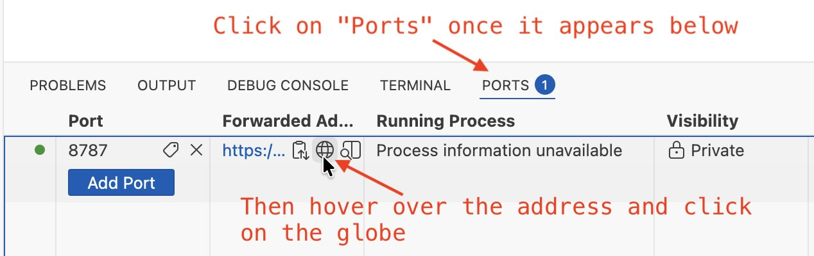

# MATH2801: Data Science and Statistical Modelling

This repository provides a [Github Codespaces](https://github.com/features/codespaces/) for the R computer labs for the [MATH2801 module](https://www.dur.ac.uk/faculty.handbook/module_description/?year=2025&module_code=MATH2801) at Durham University, delivered by [Prof. Aslett](https://www.louisaslett.com/) and [Prof. Coolen-Maturi](https://tahanimaturi.com/).

Click above to open in GitHub Codespaces, then wait a moment. Once everything loads follow the instructions in the image below to launch RStudio.

